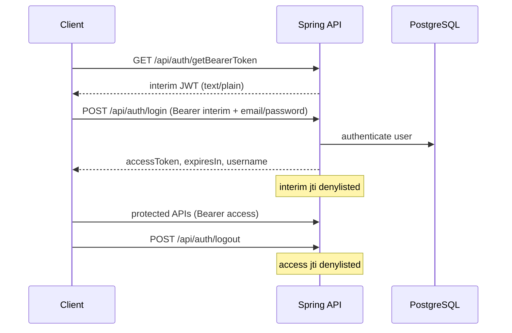
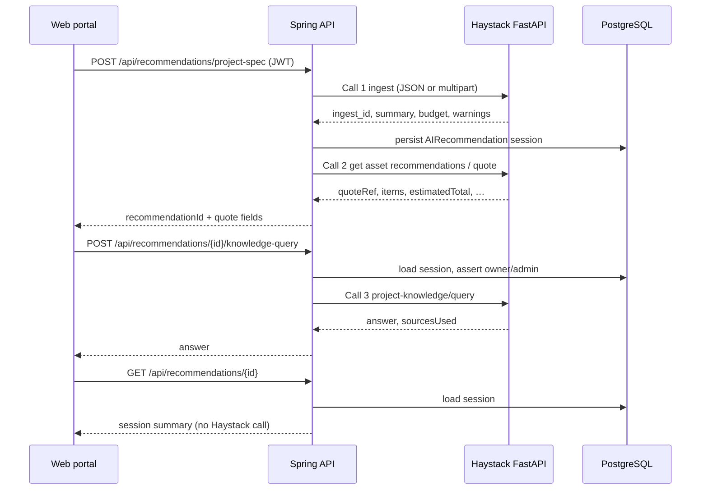

# Heavy Rental Spring REST API — Project Documentation

Comprehensive as-built overview of the **Heavy Rental** backend: architecture, business processes, domain model, configuration, and HTTP endpoints.

| Item | Value |
|------|--------|
| **Module** | `heavy-rental-spring-rest-api/` |
| **Base package** | `com.heavy_rental.rest_api` |
| **Stack** | Java 21 · Spring Boot 4.1 · PostgreSQL · OAuth2 Resource Server JWT (HS256) · Stripe · Resilience4j |
| **Default port** | `8080` |
| **Packaging** | WAR |
| **Living contracts** | [`openspec/`](openspec/) — OpenSpec `specs/` is the behavior SoT |
| **OpenSPDD** | [`spdd/`](spdd/) — REASONS canvases; per-change `openspec/changes/<id>/design.md` |
| **ADR** | `openspec/changes/<id>/adr.md` |
| **Upstream AI service** | [Heavy-Rental/haystack-fast-api](https://github.com/Heavy-Rental/haystack-fast-api) (private network only) |
| **Geocoding** | OneMap (onemap.gov.sg) — postal validation + quote `distance_km` |

This document is an integrator overview. **OpenSpec** under `openspec/specs/` is the living source of truth for feature contracts. Proposed or as-built change packs live under `openspec/changes/<id>/` with OpenSpec deltas, an OpenSPDD REASONS `design.md`, and an ADR.

---

## Table of contents

1. [What this system does](#1-what-this-system-does)
2. [Architecture](#2-architecture)
3. [Security and authentication](#3-security-and-authentication)
4. [Domain model](#4-domain-model)
5. [Core business processes](#5-core-business-processes)
6. [Endpoint reference](#6-endpoint-reference)
7. [Configuration and environment](#7-configuration-and-environment)
8. [Running, testing, and tooling](#8-running-testing-and-tooling)
9. [Design-only / not built](#9-design-only--not-built)
10. [Related documentation](#10-related-documentation)

---

## 1. What this system does

The Spring REST API is the authenticated backend for a **heavy-equipment rental** product. Clients include:

- A **web portal** (asset browse, rental plans, AI project-spec recommendations, bookings, payments, postal-code lookup)
- **Mobile / ops** flows (Google sign-in, bookings list, deliveries, returns — `ROLE_DRIVER`)
- **Admin** tools (users, asset records, monthly utilization)

The API owns:

- User identity and JWT session tokens (password login + Google ID token for mobile)
- Fleet catalog (assets, categories, images)
- Rental plans and booking lifecycle
- Stripe deposit, full-payment (GST-inclusive), and off-session balance payments
- Delivery / return operational status transitions
- Orchestration of the private **Haystack** AI recommender (ingest → quote → knowledge Q&A)
- Flag-gated Haystack **dynamic pricing** on plan quote, with Spring fallback
- OneMap geocoding for postal validation and quote `distance_km`

The browser **never** calls Haystack or Stripe secrets directly. Recommendation traffic is always:

```text
Browser → Spring (JWT) → Haystack FastAPI (internal) → Spring → Browser
```

---

## 2. Architecture

### 2.1 Layering

Controllers stay thin. Business rules live in services. Controllers must not call external HTTP clients directly.

```text
controller/     HTTP mapping, auth principal, validation annotations
    ↓
service/        Business rules, sagas, ownership checks
    ↓
repository/     Spring Data JPA
entity/         Persistence model
dto/            Request/response records

client/haystack/  RestClient + Resilience4j → haystack-fast-api (Call 1/2/3 + pricing/quote)
client/onemap/    RestClient + Resilience4j → OneMap (independent CB from Haystack)
security/         JWT mint/verify, Google ID-token verify, token denylist
config/           Security, CORS, Stripe, JWT, pricing flags, exception handler
```

### 2.2 Package map

| Package | Responsibility |
|---------|----------------|
| `controller` | REST endpoints (13 controllers, including `PostalCodeController`) |
| `service` | Auth, assets, bookings, payments, rental plans, dynamic pricing, distance, recommender saga, admin, utilization |
| `entity` / `repository` | JPA model and data access |
| `dto` | API request/response shapes |
| `client.haystack` | Typed Haystack client (Call 1/2/3, **pricing quote**, health, resilience) |
| `client.onemap` | Typed OneMap client (token + geocode, cache, CB/bulkhead, no retry) |
| `security` | `JwtService`, `GoogleTokenVerifier`, in-memory `TokenDenylist` |
| `config` | `SecurityConfig`, `RestExceptionHandler`, Stripe, CORS/JWT/`PricingProperties` |
| `mapper` | Booking → response mapping for list/delivery/return views |
| `util` | `PostalCodeUtil` |

### 2.3 External systems

| System | Role |
|--------|------|
| **PostgreSQL** | Sole application database (no H2 default) |
| **Stripe** | Deposit and full-payment PaymentIntents, webhooks, off-session balance charges |
| **Haystack FastAPI** | Project-spec ingest, equipment recommendations/quotes, knowledge Q&A, **dynamic pricing quote** |
| **OneMap** | Singapore postal-code geocoding (validation endpoint + quote `distance_km`) |
| **Google** | ID-token verification for mobile `POST /api/auth/google` |

### 2.4 Haystack / OneMap hop map (as-built)

Normative table: [`openspec/specs/spring-proxy-endpoints/spec.md`](openspec/specs/spring-proxy-endpoints/spec.md).

| Spring route | External hop | Notes |
|--------------|--------------|-------|
| `POST /api/recommendations/project-spec` | **Haystack** Call 1 then Call 2 | Dual-hop saga |
| `POST /api/recommendations/{id}/knowledge-query` | **Haystack** Call 3 only | No re-ingest |
| `GET /api/recommendations/{id}` | **No** | DB session only |
| `POST /api/rentalPlans/{id}/quote` | **Haystack** `POST /internal/v1/pricing/quote` when `pricing.dynamic-enabled=true` (module default **on**); **OneMap** for `distance_km` | Per-item Spring fallback; OneMap failure → `pricing.default-distance-km`. Flag off = Spring-only sum |
| `GET /api/postalCodes/{postalCode}` | **OneMap** (not Haystack) | Three-state VALID/INVALID/UNAVAILABLE |
| Bookings, payments, assets, users, etc. | **No** | Local business logic |

---

## 3. Security and authentication

### 3.1 Model

- **Stateless** sessions (`SessionCreationPolicy.STATELESS`)
- **CSRF disabled** for the API
- **Passwords**: BCrypt
- **Tokens**: JWT signed with **HS256** (`app.jwt.secret` ≥ 32 characters)
- **Authorities** from JWT claim `roles` (no `SCOPE_` prefix)
- Shared error JSON: `{ "error": "<code>", "message": "<reason>" }`

### 3.2 Auth process

```text
1. GET  /api/auth/getBearerToken     → interim JWT (public, text/plain)
2. POST /api/auth/login              → access JWT JSON; interim jti denylisted
   (mobile ops: POST /api/auth/google with a Google ID token instead of password)
3. Call protected APIs with          Authorization: Bearer <access-jwt>
4. POST /api/auth/logout             → access jti denylisted until exp
```

| | Interim token | Access (session) token |
|--|---------------|------------------------|
| Issued by | `GET /api/auth/getBearerToken` | `POST /api/auth/login` or `POST /api/auth/google` |
| `sub` | Random UUID | Authenticated **email** |
| `tokenType` | `interim` | `access` |
| `roles` | `["ROLE_INTERIM"]` | e.g. `["ROLE_USER"]`, `["ROLE_ADMIN"]`, `["ROLE_DRIVER"]` |
| May call | Login / Google only | Logout (USER/ADMIN/DRIVER) + role-appropriate APIs |

On successful login the interim token’s `jti` is denylisted. On logout the access token’s `jti` is denylisted. The JWT decoder rejects denylisted tokens.

### 3.3 Security rules (summary)

| Path | Access |
|------|--------|
| `GET /api/auth/getBearerToken` | Public |
| `POST /api/auth/login` | `ROLE_INTERIM` |
| `POST /api/auth/google` | `ROLE_INTERIM` |
| `POST /api/auth/logout` | `ROLE_USER`, `ROLE_ADMIN`, or `ROLE_DRIVER` |
| `POST /api/payments/webhook` | Public (auth = Stripe-Signature) |
| `GET /actuator/health`, `/actuator/info`, `/error` | Public |
| `/api/users/**` | `ROLE_ADMIN` only |
| `/api/monthly-utilization` | `ROLE_ADMIN` only |
| `POST`/`PUT`/`PATCH`/`DELETE /api/assets/**` | `ROLE_ADMIN` only |
| `/api/bookings/**` | `ROLE_USER` (own only), `ROLE_ADMIN`, `ROLE_DRIVER` |
| `/api/deliveries/**`, `/api/returns/**` | `ROLE_ADMIN` or `ROLE_DRIVER` |
| All other `/api/**` | `ROLE_USER` or `ROLE_ADMIN` |

CORS is restricted to configured origins (`app.cors.allowed-origins`; defaults `http://localhost:5173` and `http://localhost:4173`). Allowed methods: GET, POST, PUT, PATCH, DELETE, OPTIONS. Allowed headers: **`Authorization`, `Content-Type` only**. Optional `X-Correlation-Id` is accepted by recommendation/quote controllers when present, but it is **not** a CORS-allowed header — a cross-origin browser cannot send it; Postman and a same-origin Vite proxy can.

### 3.4 Error body convention

```json
{ "error": "unauthorized", "message": "Authentication required. …" }
```

Common `error` codes: `unauthorized`, `forbidden`, `invalid_credentials`, `bad_request`, `not_found`, `conflict`, `recommender_unavailable`, `recommender_timeout`, `recommender_upstream_error`, `payload_too_large`.

Validation failures (`@Valid` on request bodies) return HTTP `400` with `error` = `bad_request` (field errors joined in `message`). There is no `validation_failed` code as-built.

---

## 4. Domain model

### 4.1 Entities

| Entity | Table | Purpose |
|--------|-------|---------|
| `User` | `users` | Auth principal; unique `name`; email login; roles USER / ADMIN / DRIVER |
| `AssetCategory` | `asset_categories` | Fleet categories (e.g. Excavator, Scissors Lift, Boom Lift, Fork Lift) |
| `Asset` | `assets` | Fleet item: rates, capacity/height, condition, location (`Tuas` in seed), `serialno`, `lastConditionUpdatedAt` |
| `AssetImage` | `asset_images` | Base64 image text linked to asset; also feeds recommender `items[].equipment.img` |
| `RentalPlan` | `rental_plan` | Customer plan; status DRAFT / SAVED / QUOTED / CONVERTED / **CANCELLED**; `siteAddress` optional; `sitePostalCode` extracted when address present |
| `RentalPlanRecord` | `rental_plan_records` | Plan line items |
| `Booking` | `bookings` | Rental booking: dates, status, totals, site address, optional plan link |
| `BookingItem` | `booking_items` | Asset lines with rates and subtotals |
| `Payment` | `payments` | Deposit / balance / full; Stripe fields |
| `DeliveryRecord` | `delivery_records` | Delivery ops record (booking + driver) |
| `ReturnRecord` | `return_records` | Return ops record (booking + driver) |
| `AIRecommendation` | `ai_recommendations` | S2b session + Haystack handles (`ingest_id`, correlation, budget, warnings, …) |
| `RecommendationItem` | `recommendation_items` | Optional ranked lines |

`Booking.sitePostalCode` is derived (`@Formula`) from the trailing 6 characters of `siteAddress`. API create/update requests enforce that `siteAddress` ends with a 6-digit postal code via Bean Validation.

### 4.2 Important enums

| Enum | Values |
|------|--------|
| `User.UserRole` | `USER`, `ADMIN`, `DRIVER` |
| `ConditionType` | `EXCELLENT`, `GOOD`, `FAIR`, `NEEDS_REPAIR` |
| `RentalPlan.PlanStatus` | `DRAFT`, `SAVED`, `QUOTED`, `CONVERTED`, `CANCELLED` |
| `Booking.BookingStatus` | `PENDING_DEPOSIT`, `PENDING_CONFIRMED`, `CONFIRMED`, `MOBILISED`, `COMPLETED`, `CANCELLED` |
| `Payment.PaymentType` | `DEPOSIT`, `BALANCE`, `FULL_PAYMENT` |
| `Payment.PaymentStatus` | `PENDING`, `SUCCESS`, `FAIL` |
| `AIRecommendation.RecommendationStatus` | `GENERATED`, `ACCEPTED`, `REJECTED`, `EXPIRED` |

### 4.3 Booking status sets (shared constants)

| Set | Statuses | Used for |
|-----|----------|----------|
| **ACTIVE_STATUSES** | PENDING_DEPOSIT, PENDING_CONFIRMED, CONFIRMED, MOBILISED | Block overlapping asset availability |
| **UTILIZATION_STATUSES** | CONFIRMED, MOBILISED, COMPLETED | Monthly utilization / revenue reporting |

### 4.4 Seed data (development)

Loaded from `src/main/resources/data.sql` after Hibernate DDL (`ddl-auto=update`, `defer-datasource-initialization=true`). Flyway is disabled on the default profile. Production (`SPRING_PROFILES_ACTIVE=prod`) runs Flyway and `ddl-auto=validate`. Set GitHub Environment var `APP_SEED_DATA_SQL=true` on Academy CD to also run `data.sql` after Flyway (default off).

| Email | Password (dev) | Role |
|-------|----------------|------|
| `admin@localhost` | `admin1234` | ADMIN |
| `alex.tan@example.sg` | `customer123` | USER |
| `ravi.kumar@example.sg` | `admin123` | ADMIN |
| `ah.tan@example.sg` | `driver123` | DRIVER |
| `mei.ling@example.sg` | `customer234` | USER |
| `farid.rahman@example.sg` | `customer345` | USER |
| `mei.lin@example.sg` | `customer456` | USER |

Approximate seed scale: **27** assets across 4 categories, **91** bookings spanning statuses, mock JPEG images under `src/main/resources/mock-images/` stored as base64 in `asset_images`.

---

## 5. Core business processes

### 5.1 Authentication journey



**Login steps (normative):**

1. Assert interim JWT present and `tokenType == interim`
2. Validate email/password non-blank
3. `AuthenticationManager.authenticate(email, plainPassword)` — do **not** BCrypt-encode the request password before authenticate
4. Issue access JWT (`sub` = email, roles from DB, `tokenType` = access)
5. Denylist interim `jti` until original `exp`
6. Return `LoginResponse`

### 5.2 Asset browse and catalog (`/api/assets`)

Route family renamed from `/api/equipment` to `/api/assets`.

- List/filter assets by optional `category`, `search` (name substring), `condition`, and optional `startDate`/`endDate` window.
- When a date window is supplied, `available` reflects whether the asset has an overlapping booking in **ACTIVE_STATUSES**.
- Images are returned as JPEG data URIs: `data:image/jpeg;base64,<raw>`.
- Response includes `serialno`, `lastConditionUpdatedAt` (server-stamped only when `condition` actually changes), and current-month `utilization`.
- Reads: `ROLE_USER` or `ROLE_ADMIN`. Writes (`POST`/`PUT`/`PATCH`/`DELETE` and `PUT /{id}/image`) : **`ROLE_ADMIN` only**.
- Duplicate `name` → `409`. Photo upload is JSON base64 (`AssetImageRequest`), not multipart.

### 5.3 Rental plan quote

```text
POST /api/rentalPlans              → DRAFT plan (one active plan per customer)
PATCH /api/rentalPlans/{id}        → set/correct siteAddress
POST /api/rentalPlans/{id}/items   → add asset line
DELETE .../items/{itemId}          → remove line
POST /api/rentalPlans/{id}/quote   → compute totals, lock as QUOTED
POST /api/rentalPlans/{id}/cancel  → CANCELLED (frees the one-active-plan slot)
```

**Add-item pricing:** `DefaultPricingClient` uses inclusive day count:

```text
days = ChronoUnit.DAYS.between(start, end) + 1
subtotal = baseDailyRate × days
```

**Quote pricing (as-built):** when `pricing.dynamic-enabled=true` (module default **on**), `DynamicPricingService` calls haystack `POST /internal/v1/pricing/quote` and writes returned rates onto each line before summing. Per-item fallback to `DefaultPricingClient` if haystack is down or an item has `error`. `degraded=true` with a usable price is used as-is. Flag off = sum of snapshotted add-item subtotals, no haystack hop. Optional `X-Correlation-Id` is forwarded.

**Distance:** `DistanceService` geocodes origin `pricing.origin-postal-code` (`629462`) and the plan's `sitePostalCode` via OneMap, then haversine km. Any failure → `pricing.default-distance-km` (`20.0`); the quote still succeeds.

A customer may have only one plan in DRAFT/SAVED/QUOTED at a time (`409 conflict` otherwise). `CONVERTED` and `CANCELLED` do not count as active.

`siteAddress` on create is **optional** ("Skip for now"). WHEN PROVIDED it must end with a 6-digit postal code (`400 bad_request`). `PATCH` sets it later; changing address on a `QUOTED` plan reverts to `DRAFT` and clears `totalAmount`.

### 5.4 Booking create and payments

#### Create booking

```text
POST /api/bookings
  → resolve customer from JWT
  → validate items, dates (end after start), siteAddress postal rule
  → optional rentalPlanId link
  → reject if any asset overlaps ACTIVE booking (HTTP 409)
  → price lines: days = ChronoUnit.DAYS.between(start, end) + 1  // same inclusive convention as plans
  → deposit = 30% of total (DEPOSIT_RATE = 0.30)
  → status = PENDING_DEPOSIT
```

Plan-backed checkout (`rentalPlanId` present): items/dates/`totalAmount` come from the quoted plan; quote older than 24h → `409 quote_expired`; plan becomes `CONVERTED` in the same transaction. See [`openspec/specs/rental-plan-quote/contracts/checkout.md`](openspec/specs/rental-plan-quote/contracts/checkout.md).

#### Deposit payment

```text
POST /api/payments/deposit-intent  { "bookingId": N }
  → owner or admin
  → create Stripe PaymentIntent for depositAmount (currency sgd)
  → setup_future_usage = off_session (saves method for later balance)
  → return clientSecret + paymentIntentId
```

#### Webhook

```text
POST /api/payments/webhook
  → verify Stripe-Signature on raw body
  → handle payment_intent.succeeded / payment_intent.payment_failed
  → update Payment rows; advance booking status on successful deposit
```

#### Full payment (one-shot)

```text
POST /api/payments/full-payment-intent  { "bookingId": N }
  → owner or admin
  → Stripe PaymentIntent for totalAmount × 1.09 (GST_RATE = 0.09; no setup_future_usage)
  → persist PENDING FULL_PAYMENT
  → return clientSecret + paymentIntentId + GST-inclusive amount
```

On webhook success the booking goes **straight to CONFIRMED** with `remainingBalance = 0` (skips `PENDING_CONFIRMED`, so the balance scheduler never picks it up). Deposit/balance never collect GST — paying in full costs 9% more in absolute terms than deposit+balance (deliberate).

#### Balance charge scheduler

`BalanceChargeSchedulerService` runs daily at **02:00 Asia/Singapore**:

- Finds bookings with `startDate == tomorrow` and status `PENDING_CONFIRMED`
- Charges remaining balance off-session using the payment method saved at deposit
- Each booking is processed in its own transaction so one failure does not abort the batch

`PaymentReconciliationSchedulerService` runs every **15 minutes** and re-checks `PENDING` payments older than 10 minutes against Stripe (missed-webhook backstop).

### 5.5 Delivery and return operations

Operational state machine exposed by these APIs:

```text
CONFIRMED  --[PATCH /api/deliveries/{bookingId}/status { bookingStatus: MOBILISED }]-->  MOBILISED
MOBILISED  --[PATCH /api/returns/{bookingId}/status    { bookingStatus: COMPLETED }]-->  COMPLETED
```

- **Auth:** `ROLE_ADMIN` or `ROLE_DRIVER` only (`ROLE_USER` → `403`)
- **Today’s deliveries:** bookings with `startDate == today` and status in (CONFIRMED, MOBILISED)
- **Today’s returns:** bookings with `endDate == today` and status in (MOBILISED, COMPLETED)
- Invalid transitions return `400`

Other booking statuses (PENDING_*, CANCELLED) are not advanced by these routes. Customers (`ROLE_USER`) see/update only their own bookings; admin/driver see all.

### 5.6 AI recommender saga (S2b)

Portal journey for project-spec → equipment quote → follow-up Q&A.



#### Hard rules

- Controllers never call Haystack; orchestration is in `RecommenderSagaService` → `HaystackRecommenderClient`
- Haystack `user_id` is **server-derived** from the JWT principal — never trust a client-supplied haystack user id
- On Call 2 failure after successful Call 1: **do not re-ingest**; keep the session row
- **Never invent** equipment, rates, or synthetic catalog objects on failure
- Equipment images on quote lines: when haystack `id` matches a numeric `assets.id` with an image, Spring attaches a JPEG data URI; otherwise pass through haystack `img`

#### Haystack internal paths (Spring client)

| Op | Method | Upstream path |
|----|--------|---------------|
| Health | GET | `/health` |
| Call 1 Ingest | POST | `/internal/v1/recommendations/submitprojectspecification` |
| Call 2 Recommend | POST | `/internal/v1/recommendations/project-knowledge/getassetrecommendations` |
| Call 3 Q&A | POST | `/internal/v1/recommendations/project-knowledge/query` |
| Pricing quote | POST | `/internal/v1/pricing/quote` |

#### Resilience (Resilience4j)

Configured under `haystack.*` in `application.properties`:

- Per-operation **timeouts** (connect, health, QA, recommend, ingest)
- **Retry** with idempotency keys (ingest retry off by default until S2a confirmed)
- **Circuit breaker** (failure rate / sliding window / open wait)
- **Bulkheads** limiting concurrent ingest / recommend / QA / **pricing** calls

Typical portal error mapping when Haystack is unhealthy: `503 recommender_unavailable`, `504 recommender_timeout`, `502 recommender_upstream_error`.

### 5.7 Admin processes

- **Users:** full CRUD under `/api/users` (admin only). Create returns a temporary password.
- **Monthly utilization:** trailing six months of fleet utilization % and revenue for admin dashboards.

### 5.8 Depots stub

`GET /api/depots` always returns `[]`. There is no Depot entity; site addresses live on bookings/plans. The route exists so the frontend equipment page does not fail when it also requests depots.

---

## 6. Endpoint reference

Base URL (local): `http://localhost:8080`

Unless noted, send:

```http
Authorization: Bearer <access-jwt>
Content-Type: application/json
```

### 6.1 Master route map

| Method | Path | Auth | Domain |
|--------|------|------|--------|
| `GET` | `/actuator/health` | Public | Health |
| `GET` | `/actuator/info` | Public | Health |
| `GET` | `/api/auth/getBearerToken` | Public | Auth |
| `POST` | `/api/auth/login` | ROLE_INTERIM | Auth |
| `POST` | `/api/auth/logout` | USER/ADMIN/DRIVER | Auth |
| `POST` | `/api/auth/google` | ROLE_INTERIM | Auth (mobile) |
| `GET` | `/api/assets` | USER/ADMIN | Assets |
| `GET` | `/api/assets/{id}` | USER/ADMIN | Assets |
| `POST` | `/api/assets` | ADMIN | Assets |
| `PUT` | `/api/assets/{id}` | ADMIN | Assets |
| `PATCH` | `/api/assets/{id}` | ADMIN | Assets |
| `DELETE` | `/api/assets/{id}` | ADMIN | Assets |
| `PUT` | `/api/assets/{id}/image` | ADMIN | Assets |
| `GET` | `/api/depots` | USER/ADMIN | Depots (stub) |
| `POST` | `/api/rentalPlans` | USER/ADMIN | Rental plans |
| `GET` | `/api/rentalPlans` | USER/ADMIN (own) | Rental plans |
| `GET` | `/api/rentalPlans/{id}` | Owner | Rental plans |
| `PATCH` | `/api/rentalPlans/{id}` | Owner | Rental plans |
| `POST` | `/api/rentalPlans/{id}/items` | Owner | Rental plans |
| `DELETE` | `/api/rentalPlans/{id}/items/{itemId}` | Owner | Rental plans |
| `POST` | `/api/rentalPlans/{id}/quote` | Owner | Rental plans |
| `POST` | `/api/rentalPlans/{id}/cancel` | Owner | Rental plans |
| `GET` | `/api/postalCodes/{postalCode}` | USER/ADMIN | Postal codes |
| `POST` | `/api/bookings` | USER/ADMIN/DRIVER (JWT subject = customer) | Bookings |
| `GET` | `/api/bookings` | USER (own) / ADMIN / DRIVER | Bookings |
| `GET` | `/api/bookings/{bookingId}` | USER (own) / ADMIN / DRIVER | Bookings |
| `PUT` | `/api/bookings/{bookingId}` | USER (own) / ADMIN / DRIVER | Bookings |
| `GET` | `/api/deliveries` | ADMIN/DRIVER | Deliveries |
| `PATCH` | `/api/deliveries/{bookingId}/status` | ADMIN/DRIVER | Deliveries |
| `GET` | `/api/returns` | ADMIN/DRIVER | Returns |
| `PATCH` | `/api/returns/{bookingId}/status` | ADMIN/DRIVER | Returns |
| `POST` | `/api/payments/deposit-intent` | USER/ADMIN (owner/admin) | Payments |
| `POST` | `/api/payments/full-payment-intent` | USER/ADMIN (owner/admin) | Payments |
| `POST` | `/api/payments/webhook` | Public + Stripe-Signature | Payments |
| `POST` | `/api/recommendations/project-spec` | USER/ADMIN | Recommender |
| `POST` | `/api/recommendations/{id}/knowledge-query` | Owner/admin | Recommender |
| `GET` | `/api/recommendations/{id}` | Owner/admin | Recommender |
| `GET` | `/api/users` | ADMIN | Admin users |
| `GET` | `/api/users/{id}` | ADMIN | Admin users |
| `POST` | `/api/users` | ADMIN | Admin users |
| `PATCH` | `/api/users/{id}` | ADMIN | Admin users |
| `DELETE` | `/api/users/{id}` | ADMIN | Admin users |
| `GET` | `/api/monthly-utilization` | ADMIN | Admin utilization |

---

### 6.2 Health

| Method | Path | Auth | Success |
|--------|------|------|---------|
| `GET` | `/actuator/health` | Public | Actuator health JSON |
| `GET` | `/actuator/info` | Public | Actuator info |

---

### 6.3 Auth — `/api/auth`

#### `GET /api/auth/getBearerToken`

- **Auth:** Public  
- **Response:** `200` `text/plain` — raw interim JWT (no `Bearer` prefix)

#### `POST /api/auth/login`

```http
Authorization: Bearer <interim-jwt>
Content-Type: application/json

{ "email": "admin@localhost", "password": "admin1234" }
```

**Success `200` — `LoginResponse`:**

| Field | Type | Description |
|-------|------|-------------|
| `accessToken` | string | Session JWT |
| `tokenType` | string | `"Bearer"` |
| `expiresIn` | long | Seconds until expiry |
| `username` | string | Authenticated email (field name is historical) |

**Errors:** `400` bad request · `401` invalid credentials / unauthorized · `403` forbidden (wrong token tier)

#### `POST /api/auth/logout`

```http
Authorization: Bearer <access-jwt>
```

**Success `200`:** `{ "message": "Logged out successfully" }`

#### `POST /api/auth/google`

Mobile ops alternative to password login. Interim Bearer + `{ "idToken" }`.

- Verifies Google ID token (audience = `app.google.web-client-id`); email must be `email_verified`.
- First-time sign-in auto-provisions `ROLE_DRIVER` (never ADMIN). Existing account keeps its role.
- Success `200` — same `LoginResponse` as password login; interim `jti` denylisted.
- `400` missing token · `401` invalid/unverified · `403` access token used as Bearer or disabled account

---

### 6.4 Assets — `/api/assets`

#### `GET /api/assets`

Optional query parameters:

| Param | Notes |
|-------|--------|
| `category` | Exact category name |
| `search` | Case-insensitive name substring |
| `condition` | `ConditionType` enum name |
| `startDate` / `endDate` | ISO dates; both or neither for availability |

**Success `200`:** array of `AssetResponse`, e.g.:

```json
{
  "id": 1,
  "name": "CAT 320 Excavator",
  "category": "Excavator",
  "baseDailyRate": 450.00,
  "minDailyRate": 380.00,
  "maxDailyRate": 520.00,
  "capacity": 3500,
  "platformHeight": null,
  "purchaseYear": 2021,
  "condition": "GOOD",
  "available": true,
  "desc": "...",
  "img": "data:image/jpeg;base64,/9j/...",
  "location": "Tuas",
  "tags": [],
  "serialno": "SN-EXC-000320",
  "lastConditionUpdatedAt": "2026-08-11T09:00:00",
  "utilization": 62.5
}
```

`available` is `null` when no date window is provided. `tags` is always `[]` as-built.

#### `GET /api/assets/{id}`

Same body shape. Optional `startDate` / `endDate` for availability.

#### `POST /api/assets` → `201` (`ROLE_ADMIN`)

Body `AssetRequest`: `name`, `serialno`, `categoryId`, `baseDailyRate`, `minDailyRate`, `maxDailyRate`, `capacity`, `platformHeight`, `purchaseYear`, `condition`, `desc`, `location`. Duplicate `name` → `409`. Missing required fields → `400`.

#### `PUT /api/assets/{id}`

Full replace with `AssetRequest` (`ROLE_ADMIN`).

#### `PATCH /api/assets/{id}`

Partial update with `AssetRequest` (null fields left unchanged in service). `ROLE_ADMIN`.

#### `PUT /api/assets/{id}/image`

JSON `{ "image": "<base64>" }` — replaces the asset's photo. Blank → `400`; oversized (~7MB cap) → `413`.

#### `DELETE /api/assets/{id}` → `204`

May return `404` if missing or `409` if delete conflicts with existing usage. `ROLE_USER` writes → `403`.

---

### 6.5 Depots — `/api/depots`

#### `GET /api/depots`

**Success `200`:** `[]` (stub; no Depot entity).

---

### 6.6 Rental plans — `/api/rentalPlans`

Ownership is scoped to the JWT subject (email).

#### `POST /api/rentalPlans` → `201`

```json
{
  "startDate": "2026-08-09",
  "endDate": "2026-08-13",
  "siteAddress": "20 Jurong Port Road, 619094"
}
```

Creates a **DRAFT** plan. `siteAddress` is **optional**; WHEN PROVIDED it must end with a 6-digit postal code or `400 bad_request`. One active (DRAFT/SAVED/QUOTED) plan per customer or `409`.

#### `GET /api/rentalPlans`

Caller’s plans only → `RentalPlanResponse[]`.

#### `GET /api/rentalPlans/{id}`

Owner only; else `404`.

#### `PATCH /api/rentalPlans/{id}`

`{ "siteAddress": "20 Jurong Port Road, 619094" }` — set or correct address. Same postal rule as create. On `QUOTED`, reverts to `DRAFT` and clears `totalAmount`. `CONVERTED` → `409 already_converted`; `CANCELLED` → `409 already_cancelled`.

#### `POST /api/rentalPlans/{id}/items` → `201`

```json
{ "assetId": 1 }
```

#### `DELETE /api/rentalPlans/{id}/items/{itemId}`

Removes a line item; returns updated plan.

#### `POST /api/rentalPlans/{id}/quote`

Flag-gated Haystack pricing (see §5.3). Sets `QUOTED`, refreshes `updatedAt`. Re-quote allowed; `CONVERTED` → `409`. Optional inbound `X-Correlation-Id` (not CORS-allowed from a cross-origin browser).

#### `POST /api/rentalPlans/{id}/cancel`

Sets `CANCELLED`, clears `totalAmount`. `CONVERTED` → `409 already_converted`; already cancelled → `409 already_cancelled`.

**`RentalPlanResponse` fields:** `id`, `startDate`, `endDate`, `siteAddress`, `status`, `totalAmount`, `items[]`, `createdAt`, `updatedAt`.

---

### 6.7 Bookings — `/api/bookings`

#### `POST /api/bookings` → `201`

```json
{
  "items": [{ "assetId": 1 }],
  "startDate": "2026-08-09",
  "endDate": "2026-08-13",
  "rentalPlanId": null,
  "siteAddress": "20 Jurong Port Road, 619094",
  "deliveryNotes": ""
}
```

- Customer = JWT principal  
- Deposit rate **30%** of total  
- Initial status: `PENDING_DEPOSIT`  
- Overlapping active booking on any asset → `409 conflict`  
- Bad postal `siteAddress` → `400 bad_request`

#### `GET /api/bookings`

List bookings → `BookingResponse[]`.

#### `GET /api/bookings/{bookingId}`

Single booking or `404`.

#### `PUT /api/bookings/{bookingId}`

Full-replace `startDate`, `endDate`, `siteAddress`, `deliveryNotes` (`BookingUpdateRequest`). `siteAddress` is required (`@NotBlank` + 6-digit postal); omitting it is `400 bad_request`. Omitted dates/notes may become null. Status is not changeable here.

**`BookingResponse`:**

| Field | Type |
|-------|------|
| `bookingId` | long |
| `customerName` | string |
| `startDate` / `endDate` | date |
| `bookingStatus` | string |
| `siteAddress` | string |
| `items` | `{ assetId, assetName, serialNumber }[]` |
| `deliveryNotes` | string |
| `totalAmount` / `depositAmount` / `remainingBalance` | number |

---

### 6.8 Deliveries — `/api/deliveries`

**Auth:** `ROLE_ADMIN` or `ROLE_DRIVER` only.

#### `GET /api/deliveries`

Today’s deliveries (`startDate == today`, status CONFIRMED or MOBILISED) → `DeliveryItemResponse[]`.

#### `PATCH /api/deliveries/{bookingId}/status`

```json
{ "bookingStatus": "MOBILISED" }
```

Only legal transition: **CONFIRMED → MOBILISED**. Other transitions → `400`.

---

### 6.9 Returns — `/api/returns`

**Auth:** `ROLE_ADMIN` or `ROLE_DRIVER` only.

#### `GET /api/returns`

Today’s returns → `ReturnItemResponse[]` (includes `returnNotes` when present).

#### `PATCH /api/returns/{bookingId}/status`

```json
{
  "bookingStatus": "COMPLETED",
  "returnNotes": "optional notes"
}
```

Advances **MOBILISED → COMPLETED** (invalid transitions → `400`).

---

### 6.10 Payments — `/api/payments`

#### `POST /api/payments/deposit-intent`

```json
{ "bookingId": 1 }
```

**Success `200`:**

```json
{
  "clientSecret": "pi_..._secret_...",
  "paymentIntentId": "pi_..."
}
```

Requires booking ownership (or admin). Currency: **sgd**. Duplicate non-failed deposit or existing FULL_PAYMENT → `409`. Stripe API failures → `502`.

#### `POST /api/payments/full-payment-intent`

```json
{ "bookingId": 1 }
```

**Success `200`:** `{ "clientSecret", "paymentIntentId", "amount" }` where `amount` is GST-inclusive (`totalAmount × 1.09`). Duplicate non-FAIL DEPOSIT/BALANCE/FULL_PAYMENT → `409`.

#### `POST /api/payments/webhook`

```http
Stripe-Signature: t=...,v1=...
Content-Type: application/json

<raw Stripe event JSON>
```

- **No JWT**  
- Signature verified against raw body and `stripe.webhook.secret`  
- Invalid signature → `400` empty body  
- Handled events: `payment_intent.succeeded`, `payment_intent.payment_failed`

---

### 6.11 Recommendations (S2b) — `/api/recommendations`

Requires access JWT (`ROLE_USER` or `ROLE_ADMIN`). Session ownership: matching user unless admin.

Optional header on submit: `X-Correlation-Id` (propagated to Haystack; generated if absent). CORS does not allow this header from a cross-origin browser.

#### `POST /api/recommendations/project-spec` (JSON)

```json
{
  "projectText": "Build a two-storey warehouse with deep excavation…",
  "startDate": "2026-09-01",
  "endDate": "2026-10-15",
  "userName": "Alex Tan",
  "query": "focus on excavators and boom lifts",
  "topK": 5
}
```

Orchestrates **Call 1 then Call 2**. Response is quote-shaped (not chatbot answer).

#### `POST /api/recommendations/project-spec` (multipart)

`Content-Type: multipart/form-data`

| Part / field | Required | Notes |
|--------------|----------|--------|
| `file` | one of file or text | Project document upload |
| `projectText` | one of file or text | Free-text specification |
| `startDate` / `endDate` | no | ISO dates |
| `userName` | no | Display/audit |
| `query` | no | Call 2 focus |
| `topK` | no | Call 2 cap |

Max upload size: `haystack.max-in-memory-size` / servlet multipart (default **20MB**).

**Success `200` — `SubmitProjectSpecResponse`:**

| Field | Source | Notes |
|-------|--------|--------|
| `recommendationId` | Spring | PK for later GET / knowledge-query |
| `ingestId` | Call 1 | Stored for Call 2/3 |
| `userRequirementSummary` | Call 1 | |
| `tentativeStartDate` / `tentativeEndDate` | Portal/session | |
| `needsSummary` | Call 1 | Display needs; not fleet recs |
| `expectedBudget` | Call 1 | Never invented client-side |
| `warnings` | Call 1 + 2 | Merged soft issues |
| `correlationId` | Spring | Log join key |
| `quoteRef` | Call 2 | |
| `confidenceScore` | Call 2 | |
| `days` | Call 2 | |
| `estimatedTotal` | Call 2 | |
| `specSummary` / `rationale` | Call 2 | |
| `items[]` | Call 2 | Ranked quote lines with nested `equipment` |

Each `items[]` element includes `rankOrder`, `matchScore`, `reason`, `lineTotal`, `quantity` (Haystack pass-through; may be greater than 1 when Call 2 collapses duplicate equipment), and nested `equipment` (`id`, `name`, `category`, rates, `img`, `tags`, …). `platformHeight` may be omitted from JSON when null.

**Not returned on submit:** Call 3 `answer` / `sourcesUsed` (use knowledge-query).

#### `POST /api/recommendations/{recommendationId}/knowledge-query`

```json
{ "query": "Why was a boom lift recommended?", "topK": 5 }
```

**Call 3 only** (no ingest, no Call 2).

**Success `200`:**

```json
{
  "answer": "…",
  "sourcesUsed": ["…"]
}
```

#### `GET /api/recommendations/{recommendationId}`

DB-only session summary: ingest id, summary, dates, budget, warnings, status, correlation id, created time, etc. **No Haystack call.**

#### Recommender errors

| Condition | HTTP | `error` |
|-----------|------|---------|
| Validation | 400 | `bad_request` |
| Not found | 404 | `not_found` |
| Not owner | 403 | `forbidden` |
| Haystack 4xx | 400/422 | mapped FastAPI error when present |
| Circuit open / bulkhead | 503 | `recommender_unavailable` |
| Timeout | 504 | `recommender_timeout` |
| Upstream 5xx after policy | 502/503 | `recommender_upstream_error` |
| Payload too large | 413 | `payload_too_large` |

---

### 6.12 Admin users — `/api/users`

**Auth:** `ROLE_ADMIN` only.

| Method | Path | Body | Success |
|--------|------|------|---------|
| `GET` | `/api/users` | — | `UserResponse[]` |
| `GET` | `/api/users/{id}` | — | `UserResponse` |
| `POST` | `/api/users` | `{ "name", "email" }` | `201` `UserCreateResponse` (+ `temporaryPassword`) |
| `PATCH` | `/api/users/{id}` | partial `{ name?, email?, role? }` | `UserResponse` |
| `DELETE` | `/api/users/{id}` | — | `204` |

`UserResponse`: `{ id, name, email, role }` where `role` is the **frontend** string (`customer` ↔ USER, `employee` ↔ DRIVER, `admin` ↔ ADMIN). Create always provisions `USER` / `"customer"`; role changes only via PATCH.

---

### 6.13 Monthly utilization — `/api/monthly-utilization`

**Auth:** `ROLE_ADMIN` only.

#### `GET /api/monthly-utilization`

Trailing six months:

```json
[
  {
    "id": 1,
    "month": "Mar",
    "utilization": 12.5,
    "revenue": 1500.00
  }
]
```

`month` is a short English name (`Jan`…`Dec`), not `YYYY-MM`. Six entries, oldest → newest.

Utilization math uses shared `Booking.UTILIZATION_STATUSES` and inclusive overlap day counts so fleet-wide and per-asset views stay consistent.

---

### 6.14 Postal codes — `/api/postalCodes`

**Auth:** `ROLE_USER` or `ROLE_ADMIN`.

#### `GET /api/postalCodes/{postalCode}`

| Case | HTTP | Body |
|------|------|------|
| Resolves | `200` | `{ "status": "VALID", "postalCode", "address" }` |
| Well-formed, no match | `200` | `{ "status": "INVALID", "postalCode", "message" }` |
| Not 6 digits | `400` | `{ "error": "bad_request", "message": "Postal code must be exactly 6 digits" }` |
| OneMap down | `503` | `{ "status": "UNAVAILABLE", "postalCode", "message" }` |

Does not replace submit-time `@Pattern` on `siteAddress`. Contract: [`openspec/specs/postal-code-validation/`](openspec/specs/postal-code-validation/).

---

## 7. Configuration and environment

Primary file: `heavy-rental-spring-rest-api/src/main/resources/application.properties`.

### 7.1 Core

| Property | Default / notes |
|----------|-----------------|
| `server.port` | `8080` |
| `spring.datasource.url` | `jdbc:postgresql://${POSTGRES_HOSTNAME:db}:5432/${POSTGRES_DB:postgres}` (password from `POSTGRES_PASSWORD`, no plaintext default) |
| `spring.jpa.hibernate.ddl-auto` | `update` (default); `validate` in `prod` |
| `spring.flyway.enabled` | `false` (default); `true` in `prod` |
| `spring.flyway.locations` | `classpath:db/migration` (prod) |
| `spring.sql.init.mode` | `always` locally (seed `data.sql`); `never` in prod |
| `app.seed.data-sql` | prod only; `${APP_SEED_DATA_SQL:false}` — Academy CD overlay |
| `spring.jpa.open-in-view` | `false` |

### 7.2 JWT

| Property | Env override | Notes |
|----------|--------------|--------|
| `app.jwt.secret` | `APP_JWT_SECRET` | ≥ 32 chars for HS256; no plaintext default |
| `app.jwt.issuer` | `APP_JWT_ISSUER` | default `heavy-rental-rest-api` |
| `app.jwt.expirationMinutes` | `APP_JWT_EXPIRATION_MINUTES` | default `60` |

Google Sign-In audience: `app.google.web-client-id` / `APP_GOOGLE_WEB_CLIENT_ID`.

### 7.3 CORS

| Property | Env | Default |
|----------|-----|---------|
| `app.cors.allowed-origins` | `APP_CORS_ALLOWED_ORIGINS` | `http://localhost:5173,http://localhost:4173` |

No wildcard origin (incompatible with credentialed Authorization-header APIs). Allowed request headers: `Authorization`, `Content-Type` only.

### 7.4 Stripe

| Property | Env |
|----------|-----|
| `stripe.api.key` | `STRIPE_API_KEY` (no plaintext default) |
| `stripe.publishable.key` | `STRIPE_PUBLISHABLE_KEY` |
| `stripe.webhook.secret` | `STRIPE_WEBHOOK_SECRET` (no plaintext default) |

Currency for PaymentIntents is hardcoded **`sgd`** as-built.

### 7.5 Haystack client

| Property | Purpose | Default |
|----------|---------|---------|
| `haystack.base-url` | FastAPI base | `http://haystack-fast-api:8000` (`application.properties`; the Java POJO field default `http://localhost:8000` is overridden by this property) |
| `haystack.timeouts.connect` | Connect timeout | `5s` |
| `haystack.timeouts.health-read` | Health read | `5s` |
| `haystack.timeouts.qa-read` | Call 3 | `45s` |
| `haystack.timeouts.recommend-read` | Call 2 | `90s` |
| `haystack.timeouts.ingest-read` | Call 1 | `180s` |
| `haystack.timeouts.pricing-read` | Pricing quote | `20s` |
| `haystack.max-in-memory-size` | Body/file cap | `20MB` |
| `haystack.retry.ingest-enabled` | Ingest retry | `false` |
| `haystack.retry.*-max-attempts` | Retry caps | recommend/QA `2`; pricing `1`; ingest `2` (off until S2a) |
| `haystack.resilience.circuit-breaker-*` | CB thresholds | 50% / window 10 / min 5 / wait 30s |
| `haystack.resilience.bulkhead-*-max-concurrent` | Concurrency limits | ingest 5 · recommend/QA/pricing 10 |

Env prefixes: `HAYSTACK_*` (see properties file for exact names).

### 7.6 Pricing flags

| Property | Env | Default |
|----------|-----|---------|
| `pricing.dynamic-enabled` | `DYNAMIC_PRICING_ENABLED` | **`true`** in `application.properties` |
| `pricing.default-distance-km` | `PRICING_DEFAULT_DISTANCE_KM` | `20.0` (fallback) |
| `pricing.origin-postal-code` | `PRICING_ORIGIN_POSTAL_CODE` | `629462` |
| `pricing.distance-lookup-enabled` | `PRICING_DISTANCE_LOOKUP_ENABLED` | `true` |

### 7.7 OneMap

| Property | Env | Notes |
|----------|-----|-------|
| `onemap.email` / `onemap.password` | `ONEMAP_EMAIL` / `ONEMAP_PASSWORD` | No plaintext default |
| `onemap.base-url` | `ONEMAP_BASE_URL` | `https://www.onemap.gov.sg` |
| `onemap.timeouts.*` / `onemap.resilience.*` | `ONEMAP_*` | Independent CB from Haystack |

---

## 8. Running, testing, and tooling

### 8.1 Prerequisites

- **Java 21**
- **PostgreSQL** reachable at `POSTGRES_HOSTNAME` (default host `db`)
- Optional: **haystack-fast-api** for live recommender (tests use WireMock)
- Optional: **Stripe** keys for real deposit intents and webhooks

### 8.2 Run the API

Secrets have no plaintext defaults in `application.properties`. Export at least:

```bash
export APP_JWT_SECRET='<at least 32 characters>'
export POSTGRES_PASSWORD='<postgres password>'
# optional, needed for payments / geocoding / Google:
# export STRIPE_API_KEY=...
# export STRIPE_WEBHOOK_SECRET=...
# export ONEMAP_EMAIL=...
# export ONEMAP_PASSWORD=...
# export APP_GOOGLE_WEB_CLIENT_ID=...
```

```bash
cd heavy-rental-spring-rest-api
./mvnw spring-boot:run
```

Health check:

```bash
curl -s http://localhost:8080/actuator/health
```

Auth smoke:

```bash
INTERIM=$(curl -s http://localhost:8080/api/auth/getBearerToken)
curl -s -X POST http://localhost:8080/api/auth/login \
  -H "Authorization: Bearer $INTERIM" \
  -H "Content-Type: application/json" \
  -d '{"email":"admin@localhost","password":"admin1234"}'
```

### 8.3 Tests

```bash
cd heavy-rental-spring-rest-api
./mvnw test
```

Notable suites:

| Area | Classes |
|------|---------|
| Context | `RestApiApplicationTests` |
| Auth | `AuthenticationIntegrationTest`, `AuthServiceTest` |
| Recommender client resilience | `HaystackRecommenderClientTest`, `HaystackRetryIdempotencyTest`, `HaystackTimeoutRetryTest`, `HaystackCircuitBreakerTest`, `HaystackBulkheadTest` |
| Recommender saga | `RecommenderSagaServiceTest`, `RecommenderSagaWireMockTest`, `RecommendationControllerIntegrationTest` |
| Dynamic pricing / OneMap | `HaystackPricingClientTest`, `DynamicPricingServiceTest`, `DistanceServiceTest`, `OneMapClientTest`, `PostalCodeControllerIntegrationTest` |
| Booking / plans / returns | `BookingServiceTest`, `RentalPlanServiceTest`, `RentalPlanControllerIntegrationTest`, `ReturnServiceTest`, `BookingOpsAccessIntegrationTest` |
| Payments | `PaymentServiceTest`, `PaymentWebhookServiceTest`, `BalanceChargeSchedulerServiceTest` (`PaymentReconciliationSchedulerService` has no dedicated test class) |
| Admin assets | `AssetAdminIntegrationTest` |
| Utilization | `MonthlyUtilizationAccuracyTest` |

Full inventory: [`openspec/specs/testing/contracts/test-inventory.md`](openspec/specs/testing/contracts/test-inventory.md).

### 8.4 Postman

Collection and local environment:

- `heavy-rental-spring-rest-api/postman/Heavy-Rental-Spring-REST-API.postman_collection.json`
- `heavy-rental-spring-rest-api/postman/Heavy-Rental-Spring-REST-API.postman_environment.json`
- Guide: [`heavy-rental-spring-rest-api/postman/README.md`](heavy-rental-spring-rest-api/postman/README.md)

Recommended order: Health → Auth (interim → login) → domain folders. Default seed user in the environment is typically `alex.tan@example.sg` / `customer123`.

---

## 9. Design-only / not built

| Item | Notes |
|------|--------|
| `POST /api/pricing/estimate` | Design only — `openspec/changes/pricing-estimate/` (open availability decision). Spring-only arithmetic **by design**, not a Haystack proxy |
| Real Depot resource | `/api/depots` is an empty stub |

The following are **as-built** (do not treat their change packs as unimplemented):

| Item | Living SoT |
|------|------------|
| Plan → booking checkout | `openspec/specs/rental-plan-quote/` + `booking-delivery-return`; archive `changes/archive/2026-08-13-rental-plan-checkout-conversion/` |
| Haystack-backed quote pricing | `openspec/specs/rental-plan-quote/` FR-RP-006; change `changes/dynamic-plan-quote-pricing/` (OpenSPDD + ADR) |
| OneMap distance + postal validation + optional site address | `openspec/specs/postal-code-validation/` + FR-RP-008/011/012; change `changes/pricing-postal-distance/` (OpenSPDD + ADR) |

Do not treat design-only docs as as-built API behavior.

---

## 10. Related documentation

| Path | Contents |
|------|----------|
| [`openspec/project.md`](openspec/project.md) | OpenSpec index and constitution |
| [`openspec/AGENTS.md`](openspec/AGENTS.md) | Reading order |
| [`openspec/specs/api-index/contracts/routes.md`](openspec/specs/api-index/contracts/routes.md) | Living route map |
| [`openspec/specs/`](openspec/specs/) | Per-capability behavior + contracts |
| [`spdd/README.md`](spdd/README.md) | OpenSPDD REASONS inventory |
| [`openspec/changes/dynamic-plan-quote-pricing/`](openspec/changes/dynamic-plan-quote-pricing/) | Quote pricing — OpenSpec + OpenSPDD + ADR |
| [`openspec/changes/pricing-postal-distance/`](openspec/changes/pricing-postal-distance/) | OneMap distance / postal — OpenSpec + OpenSPDD + ADR |
| [`openspec/changes/2026-08-20-call2-quote-quantity-passthrough/`](openspec/changes/2026-08-20-call2-quote-quantity-passthrough/) | FR-S2B-011 quantity — OpenSpec + OpenSPDD + ADR |
| [`openspec/specs/spring-proxy-endpoints/spec.md`](openspec/specs/spring-proxy-endpoints/spec.md) | Which routes hop to Haystack / OneMap |
| [`Feasibility_Study_Spring/`](Feasibility_Study_Spring/) | Spring ↔ Haystack wire notes and handoff |
| [`postman/`](postman/) | Manual API collection |

---

## Quick process cheat sheet

```text
Auth:     getBearerToken → login | google → (API calls) → logout
Plan:     create plan (address optional) → add items → quote (Haystack ML, Spring fallback) → checkout
Book:     create booking (30% deposit) or full-payment-intent (GST) → Stripe → webhook
Ops:      CONFIRMED → deliver MOBILISED → return COMPLETED  (ADMIN/DRIVER)
AI:       project-spec (Call1+Call2 quote) → knowledge-query (Call3) → get session
Postal:   GET /api/postalCodes/{code}  (OneMap; 503 must not hard-block checkout)
Admin:    /api/users , /api/assets writes , /api/monthly-utilization
```

---

*As-built project documentation for the Heavy Rental Spring REST API. Prefer OpenSpec contracts (`openspec/specs/`) when implementing or changing behavior; record trade-offs as ADRs and generation prompts as OpenSPDD REASONS canvases.*
